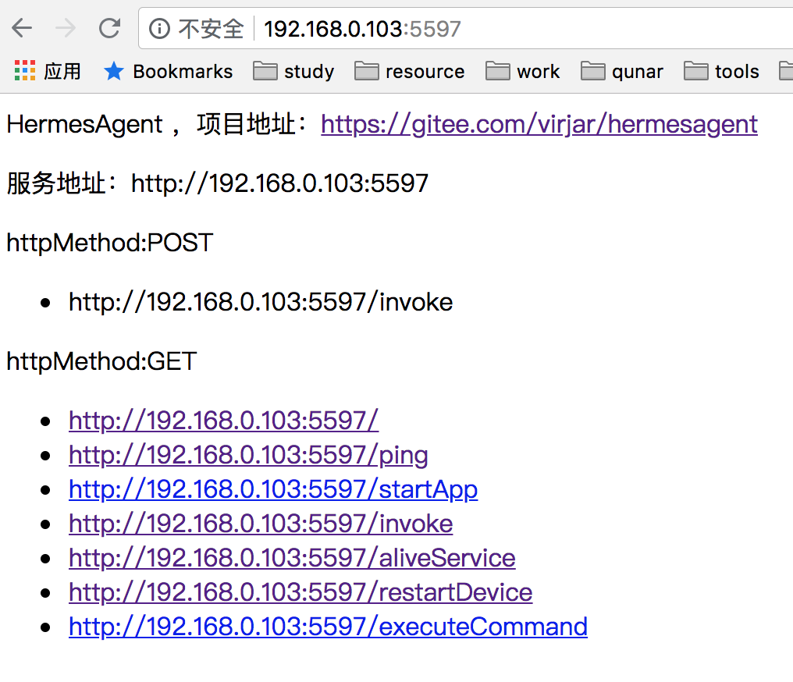
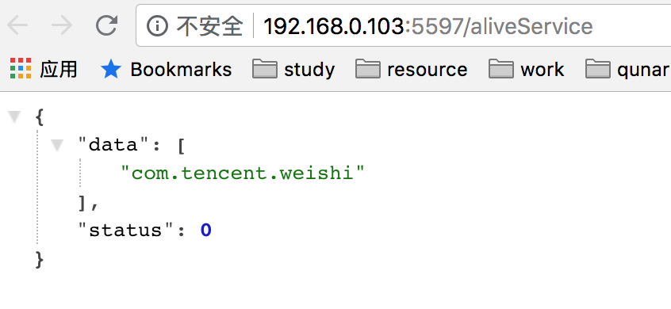
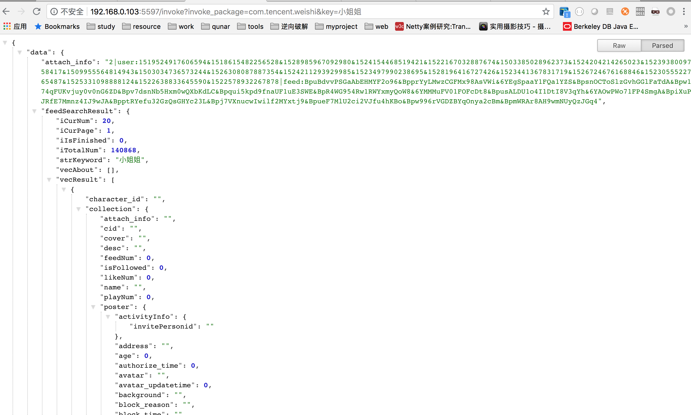

# hermesagent

#### 项目介绍
android群控系统，使用xposed+RPC实现方法级别的群控

hermesagent是hermes系统的客户端模块，也是系统最核心的模块了，他是种植在手机里面的一个agent，同时他也是一个xposed的模块插件，agent本身启动了一个service，agent插件模块将会自动注册钩子函数，并且和service通信。Android设备外部请求可以通过暴露在agent上面的一个http端口，和agent通信，然后agent和目标apkRPC。
如此实现外部请求到任何一个app的任何功能的外部调用


#### 关联项目
HermesAdmin ：https://gitee.com/virjar/hermesadmin
hermesAdmin用来管理多个hermesAgent，进行简单的服务治理和agent运维工作

#### 软件架构
软件架构说明


#### 安装教程

1. 修改server服务器地址
2. 编译app正式版
3. 安装app到手机上面
4. Android手机安装xposed环境，并且启用我们的xposed模块，然后重启xposed（xposed项目的标准流程）
5. 书写目标app插件代码，实现 com.virjar.hermes.hermesagent.plugin.AgentCallback
6. 安装目标app到手机，并启动目标app
7. 通过浏览器访问app所在ip的5597端口，查看服务列表
8. 通过invoke接口，调用服务api

#### 使用说明

1. 要安装xposed
2. xposed启用本模块之后，第一次需要重启，后续不需要重启了
3. 钩子函数写到com.virjar.hermes.hermesagent.hookagent路径下，能够被框架自动识别，其他地方不会识别
4. agent必须提供空参构造（我们是类扫描机制实现的）
5. 开启网络访问权限，有些手机在后台运行之后，将会禁止后台访问网络。请放开这个配置（小米系统hermes已经做了适配，无需关心此设置）
6. 如果在AndroidStudio上面编译本项目，需要安装lombok插件，见：[projectlombok](https://projectlombok.org/setup/android)
7. 允许程序开机自启（小米系统hermes已经做了适配，无需关心此设置）
为了让app全自动提供服务，需要让手机开机便启动agent，有些系统会禁止该行为。如果你的手机有存在该行为的话，请放开自启动限制
[stackoverflow](https://stackoverflow.com/questions/32032329/process-is-not-permitted-to-autostart-boot-complete-broadcast-receiver)
*一定要打开自启动，每个相关的都要打开*
8. 保持屏幕唤醒，在锁屏状态下，不允许拉起app的launcherActivity（小米系统hermes已经做了适配，无需关心此设置）


### 演示
1. 查看首页，观察可以提供的接口


2.观察已经注册成功，可以提供调用的服务


3.调用目标接口


其中，本demo提供了微视的话题搜索接口破解，可以通过一个关键字搜索微视的视频数据。微视demo的地址为：

https://gitee.com/virjar/hermesagent/blob/master/app/src/main/java/com/virjar/hermes/hermesagent/hookagent/WeiShiAgent.java

### 运维相关
Q: agent意外死掉，但是没有自动被拉起   
A: 大多数情况是没有放开自启动限制导致的，在小米系统上面，将会限制app被广播启动的功能，此时app启动广播将会被操作系统拦截。
极少可能是Hermes系统所有节点在同一时刻被杀死，此时系统进程之间无法实现多进程相互守护了。

Q: 手机运行一段时间之后，突然请求卡顿，接口请求全部超时   
A: 观察系统日志，系统内部master和slave可以正常通信，此时可能是你没有开启后台的网络权限。一些操作系统可能在app被切到后台之后，禁止网络通信

Q:master和slave都正常运行，但是在agent上面查看服务列表，对应服务一直不在服务列表中   
A:服务注册的原理是，在slave中注入钩子代码，驱动slave主动注册service到master。一般注册不成功的原因是钩子代码注入失败   
我们使用xposed作为代码注入的base lib，可以观察是否xposed本身模块启动失败。1.xposed未安装完整；2.xposed中没有开启本插件；3.高版本中，xposed存在一个bug，导致在Android启动的时候，使用错误的插件apk地址进行加载，进而无法加载到插件代码（同一个apk，覆盖安装，系统重启之后，apk代码地址将会被系统整理而改变路径，xposed模块管理使用的整理之前的apk地址）
第三个原因，是系统拦截了xposedInstaller自启动广播导致的。目前Hermes已经自动处理了这个问题，只要是Hermes模块正常启动的过程，XposedInstall安装过程会放开对应广播传递

Q: 安装hermesAgent之后，手机频繁重启，大约开机10分钟之后重启一次    
A: 这可能是hermes拆解小米神隐模式失败导致的，hermes daemon会有心跳检查hermes的http server是否存活，如果检查到hermes没有响应，那么认为hermesAgent的主进程变为僵尸状态了，此时会重启系统。此心跳使用http接口探测，如果网络被系统省电模式拦截，由于网络不通，daemon会假定是server假死

#### 参与贡献

1. Fork 本项目
2. 新建 Feat_xxx 分支
3. 提交代码
4. 新建 Pull Request

#### 合作

开源即免费，我不限制你们拿去搞事情，但是开源并不代表义务解答问题。如果你发现了有意思的bug，或者有建设性意见，我乐意参与讨论。
如果你想寻求解决方案，但是又没有能力驾驭这个项目，欢迎走商务合作通道。联系qq：819154316，或者加群：569543649。
拒绝回答常见问题！！！

#### todo list

1. 自动配置网络，如果系统系统启动，网络不正常，根据配置策略配置网络连接参数。如wiki账号密码，系统代理等
2. 拆解后台网络流量拦截限制（小米系统）。目前app安装之后，需要放开多个app的网络后台限制配置。可以通过app内嵌代码统一拆解（done）
3. 垃圾文件异步清理，在IPC过程中，可能存在大问题传递，由于某种原因，可能临时文件没有清除成功。这可能导致手机存储被无效文件占用。导致磁盘被打爆
4. Hermes系统日志整理，目前hermes相关日志没有统一tag。无法方便排查Hermes本身的问题，需要考虑串联Hermes系统日志（done，区分业务日志和hermes系统日志，业务日志在logcat，系统日志存文件按小时拆分，12小时翻滚）
5. 内网穿透方案，考虑Android手机运行在私有网络，server在公有网络。server可以转发invoke请求到达处于私有网络下面的Android手机中
6. 定时重启adb远程服务，（done）
7. 小米系统，powerKeeper换一个姿势解决，后续发现，powerKeeper是通过定时任务，从数据库里面拿出配置，然后封禁网络。所以可以直接拦截powerKeeper定时任务，而不是去修改powerKeeper的数据库
8. bug: http://www.cnblogs.com/panchanggui/p/9436348.html RFC3986规定，param中，可以使用"+"或则"%20"表示空格，所以在参数解码的时候，需要将"+"翻译成空格，目前没有做这个工作，这会导致参数传递过程发生问题
```
10-11 21:16:11.449  4801  5468 D PowerKeeperConfigureProvider: appActiveTable insert 1
10-11 21:16:11.451  4801  5468 D ActiveStateController: updateRuleForUidLocked, uid = 1001 property = 1
10-11 21:16:11.451  4801  5468 D PowerKeeperConfigureProvider: appActiveTable insert 2
10-11 21:16:11.452  4801  5468 D ActiveStateController: updateRuleForUidLocked, uid = 1002 property = 1
10-11 21:16:12.179  4801  5468 D PowerKeeper.KillControl: setUidState, uid = 10091 allow = true
10-11 21:16:11.813   323  2801 D DnsProxyBlocker: add uid(10109) for Firewall
10-11 21:16:11.813   323  2801 D DnsProxyBlocker: add uid(10110) for Firewall
10-11 21:16:12.088  4801  5468 I PowerKeeper.KillControl: enable
10-11 21:16:12.133  4801  5468 D PowerKeeper.KillControl: setUidState, uid = 10051 allow = true
10-11 21:16:12.133  4801  5468 D PowerKeeper.KillControl: setUidState, uid = 10052 allow = true
10-11 21:16:12.586  4801  5468 D PowerKeeper.FrozenApp: setUidState, uid = 10128 allow = true
10-11 21:16:12.588  4801  5468 D PowerKeeper.FrozenApp: setUidState, uid = 10138 allow = true
10-11 21:16:12.600  4801  5468 I PowerKeeper.Sensor: enable
10-11 21:16:12.618  4801  5468 V PowerKeeper.Sensor: SensorController enable
10-11 21:16:12.620  4801  5468 D PowerKeeper.Sensor: setUidState, uid = 10053 allow = true
10-11 21:16:12.964  4801  5528 D PowerCheckerService: onBatteryChanged, mBatteryLevel = 91, status = 3, level = 91, plug = 2
10-11 21:16:12.964  4801  5528 D PowerCheckerService: reset
10-11 21:16:12.964  4801  5528 D PowerChecker.BaStats: setEnabledStateLocked, enable = true, reset = true
10-11 21:16:12.964  4801  5528 D PowerChecker.BaStats: Updating network stats
10-11 21:16:12.965  4801  5528 D PowerChecker.BaStats: update background network stats
10-11 21:16:12.971  4801  5528 D PowerChecker.BaStats: uid 0: stats rx=617 tx=637 rxPackets=5 txPackets=10

```

#### 捐赠
如果你觉得作者辛苦了，可以的话请我喝杯咖啡

