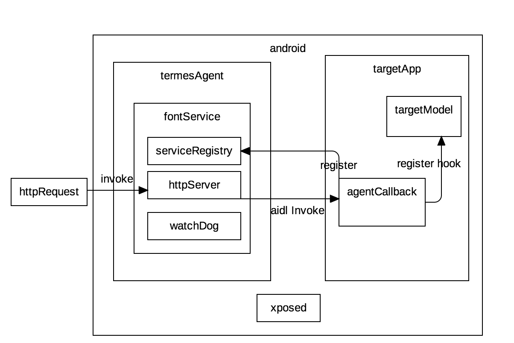

# hermesagent

#### 项目介绍
android群控系统，使用xposed+RPC实现方法级别的群控

hermesagent是hermes系统的客户端模块，也是系统最核心的模块了，他是种植在手机里面的一个agent，同时他也是一个xposed的模块插件，agent本身启动了一个service，agent插件模块将会自动注册钩子函数，并且和service通信。Android设备外部请求可以通过暴露在agent上面的一个http端口，和agent通信，然后agent和目标apkRPC。
如此实现外部请求到任何一个app的任何功能的外部调用

#### 软件架构
软件架构说明

#### 安装教程

1. 修改server服务器地址
2. 编译app正式版
3. 安装app到手机上面
4. Android手机安装xposed环境，并且启用我们的xposed模块，然后重启xposed（xposed项目的标准流程）
5. 书写目标app插件代码，实现 com.virjar.hermes.hermesagent.plugin.AgentCallback
6. 安装目标app到手机，并启动目标app
7. 通过浏览器访问app所在ip的5597端口，查看服务列表
8. 通过invoke接口，调用服务api

#### 使用说明

1. xxxx
2. xxxx
3. xxxx

#### 参与贡献

1. Fork 本项目
2. 新建 Feat_xxx 分支
3. 提交代码
4. 新建 Pull Request

#### 码云特技

1. 使用 Readme\_XXX.md 来支持不同的语言，例如 Readme\_en.md, Readme\_zh.md
2. 码云官方博客 [blog.gitee.com](https://blog.gitee.com)
3. 你可以 [https://gitee.com/explore](https://gitee.com/explore) 这个地址来了解码云上的优秀开源项目
4. [GVP](https://gitee.com/gvp) 全称是码云最有价值开源项目，是码云综合评定出的优秀开源项目
5. 码云官方提供的使用手册 [https://gitee.com/help](https://gitee.com/help)
6. 码云封面人物是一档用来展示码云会员风采的栏目 [https://gitee.com/gitee-stars/](https://gitee.com/gitee-stars/)